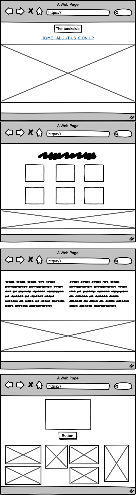
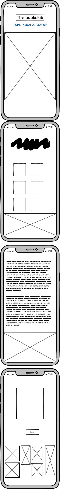

# The Bookclub

The Bookclub is the website for the Gothenburg based bookclub with the same name.
The site is created for the audience that wants to know more about this bookclub and hopefully is interested to join. 

The website includes three sections, one main section with a short info about different groups, 
one section about the story behind the creation of the bookclub, and one section with a signup form, allowing the visitor to sign up for one of the clubs.

The link to my webpage can be found here - [The Bookclub](https://tildeholmqvist.github.io/projectone/)

## Site Owner Goals

- To provide the user with information about the bookclub.
- To provide the user with information about the different clubs they can join depending on their choice of genre.
- To present the user with a website that is easy to navigate, fully responsive and that contains a simple and calming layout and design.
- To allow users to sign up for any of the different bookclubs.

## User Stories

- ### First time user

  - As a first time user I want to understand what the bookclub is and what my choices in what genre, are. 
  - As a first time user I want to be able to easly navigate through the website and easy find what I am looking for.
  - As a first time user I want to be able to sign up for any clubs. 

- ### Returning User

  - As a returning user I want to easily navigate to the signup form where I can join a bookclub.
  - As a returning user I want to be able to easily find more information about the website and it's story behind.
  - As a returning user I want to be able to sign-up to different bookclubs.

## Wireframes

Wireframes were produced using Balsamiq.

 

 
Desktop Wireframe

 

 

    
Mobile Wireframe

 

## Features

- Navigation
 - Home
 - About us
 - Sign Up 

## Header & Navigation

The navigation section is based at the top of the page, inside the header and allows the visiter to navigate through the different parts of the page by clicking on the names of the page under the logo.
The design of the header is simple, with a clean layout followed by a image depicting an open book.

## Homepage, About us & Sign up

In the homepage you can find all the information on the website, since it's a flowing layout and not placed on different pages. The first part of the page is the "home page" wich is a section explaining to the visitor what kind of different clubs and genres there is, what times the meeting is at and where they're placed.

The second part is the "About us" section thats includes a short introduction about what the clubs goals and visions is, and how it all started, followed by different images showing off the current community. 

The third part is the sign me up form, where you as a user can choose a club to join. The visitor has to add their first name, last name and email adress beforechoosing what genre they prefer. When the visitor submits their answers they are being directed to the [Code Institute formdump](https://formdump.codeinstitute.net/).

## Footer

My footer contains the different symbols for the websites different socialmedia accounts, and an adress to where to find the bookclubs office. 

All the symbols are borrowed from [Font Awesome](https://fontawesome.com/).

# Layout & Design 

My layout is simple and easy to navigate through.
For a first time visitor the webpage appears clean and structured, with soft colors and images.

#### Colours

The color scheme of the bookclubs website goes in red  orange and yellow.
I choose to work with this colors since they fit the purpose of the website well, and is both kind and calming colors. The softer colors fit the website and the purpose of the website and is a commun used colorpalette for this type of sites that often is in the brown and red spectra.  The text is in black to make it easier to read for the visitor.

#### Images

The images is depicting books and reading, to fit the cause of the site, and goes in the same color scheme as the choices of colors on my text, header and footer. All images is borrowed from  [Pexels](https://www.pexels.com/sv-se/sok/reading/).

#### Fonts

Im using the Abril Fatface font for all my headings on the page, and for the paragraphs and in my sign up form im using the font Raleway, with a backup of sans serif on both fonts. 
Both the fonts is borrowed from [Google Fonts](https://fonts.google.com/).

# Technologies 

The technologies that is beeing used on this project is:
- HTML 5
- CSS

# Testing

## W3C Validator HTML

No errors where found in my code. 

[W3C Validator](https://validator.w3.org/)

## W3C Validator CSS

No errors where found in my css. 

[W3C Validator CSS](https://jigsaw.w3.org/css-validator/)

## Lighthouse 

When the website was tested through Lighthouse, it got a score above 90 on all different scores.

## Broswer Testing 

The webpage has been tested on different broswers such as Google Chrome, Safari and Firefox and is working correctly.

## Device Testing 

The webpage has been tested on different devices such as Iphone, Ipad, MacBook Pro and iMac, and is working correctly. 

## Responsiveness

The webpage responsiveness has been tested through the Google Chrom Dev Tool, [Am I Responsive?](https://ui.dev/amiresponsive) and [Responsinator](http://www.responsinator.com/) and is working correctly.

## Form Testing

The form has been tested on different devices and different browsers, and is working correctly. 

## Link Testing 

The links has been tested on different devices and different browsers, and is working correctly. 

# Bugs and Issues

When I tested my website I did not scored 100 on accessibility, that is because of the choice of my colors. 
I chose to keep the colors on the header and the white text anyway since the score was not to low, and the colors fits the design and layout.

Another issue is the images. On a bigger screen the images appears blurry. 
This is because I tried to compress the images to smaller sizes to get a better outcome on the score of performance and how much time my website will take to load. 

# Unfixed Bugs

The issue with the blurry images is still there, but I decided to keep the images blurry on desktop screens, just so I could get a better performance. 

# Deployment

The website was deployed through the hosting platform GitHub. 
How to deploy through GitHub: 
- Go to GitHub.com .
- Select the repository.
- Once your in the repository, select settings at the top of the page to the right. 
- In the menu to your left, go into "pages". 
- Under "Branch" use the dropdown menu and select "main" and "/root", and save. 
- When it's saved you will get the link to your active website. 

Here you can mind the active link for [The Bookclub](https://tildeholmqvist.github.io/projectone/)

# Credits 

- [Pexels](https://www.pexels.com/sv-se/)
- [Tiny PNG](https://tinypng.com/)
- [Font Awesome](https://fontawesome.com/)
- [Google Font](https://fonts.google.com/)
- [Adobe Color](https://color.adobe.com/sv/create/color-wheel)
- [Love Running](https://tildeholmqvist.github.io/loverunning/)
- [Mind Yoga](https://aliokeeffe.github.io/mindyoga/)
- [Grid Templet Columns](https://developer.mozilla.org/en-US/docs/Web/CSS/grid-template-columns)
- [Balsamic](https://balsamiq.com/wireframes/desktop/#)
- Tutor Assistence for the support. 
- My mentor Antonio for his advice.
